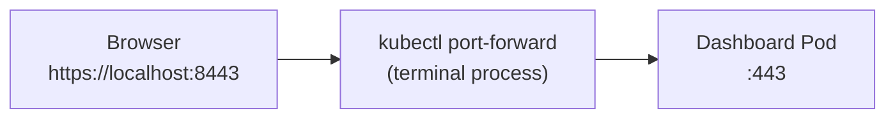
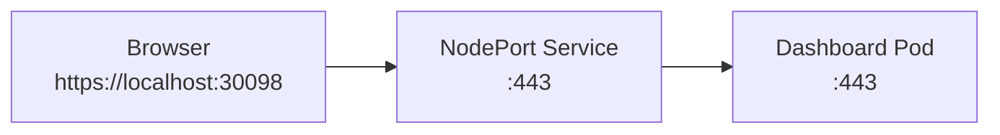
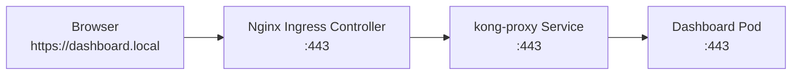

# Access the Canonical MicroK8s Kubernetes Dashboard

## Contents

- [Audience](#audience)
- [Introduction](#introduction)
- [Choose your method](#choose-your-method)
- [Dashboard access options](#dashboard-access-options)
  - [kubectl port-forward](#kubectl-port-forward)
  - [kubectl proxy](#kubectl-proxy)
  - [NodePort](#nodeport)
  - [Ingress Controller](#ingress-controller)
- [Prerequisites](#prerequisites)
- [Port-forward method](#port-forward-method)
- [NodePort method](#nodeport-method)
- [Ingress controller method](#ingress-controller-method)

## Audience

This guide is intended for developers running MicroK8s on a single local
machine with a single-node cluster. It focuses on access patterns for the Kubernetes
Dashboard in that environment. Multi-node clusters, RBAC-enabled setups, and VM networking scenarios are out of scope.

The steps in this tutorial are tested on Ubuntu 24.04 LTS with MicroK8s 1.33.9. This is tested with the Kubernetes cluster and browser on the same host. Virtualised deployments have different networking requirements and you should consider this when trying the steps.

These steps use a Kubernetes bearer token to authenticate with the Kubernetes Dashboard. If you're using RBAC, use the steps in the [upstream Kubernetes documentation](https://github.com/kubernetes/dashboard/blob/master/docs/user/access-control/creating-sample-user.md).

## Introduction

I have always been frustrated with the documentation for accessing the Kubernetes Dashboard. I want to share the easiest methods you can use to set up Dashboard access.

The Kubernetes Dashboard setup documentation often suggests to use either the `kubectl port-forward` or `kubectl proxy` methods. I find these methods awkward and temporary, which isn't helpful if you want to keep the Dashboard available over time. It's also quite confusing for new users.

> [!NOTE]
> This tutorial doesn't include step-by-step instructions for the `kubectl proxy` method as that seems to be the least preferred option as it exposes the whole Kubernetes API.

## Choose your method

Before you delve into the details, you might want a very quick suggestion on which method is right for you. Here are my thoughts:

* Most developers: use the [port-forward method](#port-forward-method)
* Homelabs: use the [NodePort method](#nodeport-method)
* Production: use the [Ingress method](#ingress-controller-method)

## Dashboard access options

There are four primary ways to access the Dashboard. Choosing the right one depends on whether you need temporary or permanent access, and the level of security that suits your environment.

All the methods shown here require you to provide a bearer token at the Dashboard authentication screen.

| Method | Setup Ease | Security | Best For | Exposes to network? | Requires kubectl? |
|---|---|---|---|---|---|
| Port-forward | ⭐⭐⭐ | 🔒 High | Local debugging & development | No | Yes |
| Proxy | ⭐⭐ | 🔒 High | Direct API interaction | No | Yes |
| NodePort | ⭐⭐ | ⚠️ Low | Home labs and LAN access | Maybe | No |
| Ingress | ⭐ | 🛡️ Very High | Production-grade local environments | Maybe | No |

### kubectl port-forward
This creates a secure, temporary tunnel from your local machine directly to the Dashboard service.

* **Benefits**: Instant set up; no cluster configuration changes required; bypasses DNS issues.
* **Drawbacks**: Must keep the terminal window open; tunnel can break if the Pod restarts.
* **Security**: High. The service is only exposed to your local loopback (127.0.0.1). It's invisible to the rest of your network.

### kubectl proxy
This uses the Kubernetes API server as a gateway to reach the service.

* **Benefits**: Reliable for reaching the API directly; no extra port configuration.
* **Drawbacks**: The URL is extremely long and complex; can be slow; occasionally breaks CSS/JavaScript loading.
* **Security**: High. Like port-forwarding, it is restricted to local access only.

### NodePort
This opens a specific port (range 30000-32767) on your host's physical IP address.

* **Benefits**: Persistent (no terminal command needed); accessible from other devices on your network.
* **Drawbacks**: Uses non-standard ports (for example, `32000`); manual port management is messy.
* **Security**: Low/Risky. Your Dashboard login page is available on your network. Anyone with your IP and the port number can attempt to log in.

### Ingress Controller
This uses an Ingress controller, like Nginx, that routes traffic to your Dashboard based on a hostname (for example, dashboard.local).

* **Benefits**: Uses standard ports (80/443); handles SSL/TLS certificates centrally; the production standard.
* **Drawbacks**: Most complex to set up; requires an Ingress controller (for example, `microk8s enable ingress`).
* **Security**: Very High. Allows for advanced IP access listing, and proper SSL/TLS encryption.

## Prerequisites

The MicroK8s install creates a single node Kubernetes cluster that acts as both the control plane and worker node. You also need to install the Dashboard and get the bearer token to access it.

1. Install MicroK8s:

   ```bash
   sudo snap install microk8s --classic
   microk8s status --wait-ready
   sudo usermod -a -G microk8s $USER
   newgrp microk8s
   ```

   **Note**: For the user settings to persist you'll need to log out and log back into the system. If this is a temporary deployment, make sure you're using the same terminal session to save you having to log out and in again.

2. Check the single node cluster is up:

   ```bash
   microk8s kubectl get nodes -o wide
   ```

   You should see output similar to:

   ```text
   NAME    STATUS   ROLES    AGE     VERSION   INTERNAL-IP      EXTERNAL-IP   OS-IMAGE             KERNEL-VERSION      CONTAINER-RUNTIME
   beast   Ready    <none>   4h34m   v1.33.9   192.168.86.237   <none>        Ubuntu 24.04.4 LTS   6.17.0-19-generic   containerd://1.7.27
   ```

3. Install the Dashboard:

   ```bash
   microk8s enable dashboard
   ```

4. Get the access token. MicroK8s creates the secret that contains the access token (`microk8s-dashboard-token`) when it creates the single node cluster:

   ```bash
   microk8s kubectl get secret microk8s-dashboard-token -o jsonpath='{.data.token}' -n kube-system | base64 --decode
   ```

   You'll see output similar to:

   `eyJhbGciOiJSUzI1NiIsImtpZCI6IlZxRWdQVGtUZkVJZVhaeVpnT1pOaUJvVTl1WWdFUmR3...`

   Copy the token output.

## Port-forward method



The [Canonical documentation](https://canonical.com/microk8s/docs/addon-dashboard) suggests using the `kubectl port-forward` method. This is great if you want to have temporary access to the Dashboard, but becomes a little annoying when you want the Dashboard to be available for longer than the life of your terminal session. It also ties up your terminal (unless you append `&` to background the task or use a `tmux` session).

1. Run the port-forward command:

   ```bash
   microk8s kubectl -n kubernetes-dashboard port-forward svc/kubernetes-dashboard-kong-proxy 8443:443
   ```

2. Open your browser and navigate to `https://localhost:8443`.

   **Note**: Because this uses a self-signed certificate, your browser will show a "Privacy error." Click **Advanced** and then **Proceed to localhost**. You will be prompted for your bearer token to authenticate.

3. Paste your bearer token at the login screen to authenticate and access the Dashboard.

You can also set this up as a systemd service, but that's out of scope for this guide.

## NodePort method



The method I much prefer in my testing lab is to edit the `kubernetes-dashboard` service to use NodePort instead of ClusterIP. It's important to know this is less secure, but in my development environment I'm confident that nobody can get through my firewall and then through to my cluster. It's such an easy method, that it's worth writing about. I know from personal experience that technical writers out there are discouraged from documenting it.

> [!WARNING]
> This method leaves cluster access open to your whole network, so consider your environment security needs before you do this. An access token is still required to access the cluster.

1. Edit the `kubernetes-dashboard` service and change `type: ClusterIP` to `type: NodePort`:

   ```bash
   microk8s kubectl edit svc kubernetes-dashboard-kong-proxy -n kubernetes-dashboard
   ```

2. Find the port on which the service is being served:

   ```bash
   microk8s kubectl get svc -n kubernetes-dashboard | grep kubernetes-dashboard-kong-proxy
   ```

   You'll see output similar to:

   ```text
   kubernetes-dashboard-kong-proxy   NodePort   10.152.183.126   <none>   443:30098/TCP   2m24s
   ```

   Use the second port listed (after the colon). In this example that would give you `https://localhost:30098`.

3. Open your browser and navigate to `https://localhost:PORT`, substituting `PORT` with the port number from the previous step.

   **Note**: Because this uses a self-signed certificate, your browser will show a "Privacy error." Click **Advanced** and then **Proceed to localhost**. You will be prompted for your bearer token to authenticate.

4. Paste your bearer token at the login screen to authenticate and access the Dashboard.


## Ingress controller method



The Ingress method uses a "Front Door" controller to route traffic to your dashboard using a custom domain name. This is the most stable and production-like way to access your cluster services.

1. Enable the Ingress addon. MicroK8s includes a built-in Nginx Ingress controller:

   ```bash
   microk8s enable ingress
   ```

2. Map the domain to your machine. Since `dashboard.local` isn't a real website on the internet, you must tell Ubuntu to look for it on your own machine. Edit your `/etc/hosts` file:

   ```bash
   sudo nano /etc/hosts
   ```

   Add this line to the bottom:

   ```text
   127.0.0.1  dashboard.local
   ```

3. Create the Ingress configuration. Create a file named `dashboard-ingress.yaml` with the following content. This tells the Ingress controller to listen for `dashboard.local` and send that traffic to the Dashboard's secure gateway:

   ```yaml
   apiVersion: networking.k8s.io/v1
   kind: Ingress
   metadata:
     name: kubernetes-dashboard-ingress
     namespace: kubernetes-dashboard
     annotations:
       # Required: Tells Nginx the backend service uses HTTPS
       nginx.ingress.kubernetes.io/backend-protocol: "HTTPS"
       # Optional: Prevents timeouts during long sessions
       nginx.ingress.kubernetes.io/proxy-connect-timeout: "300"
   spec:
     rules:
     - host: dashboard.local
       http:
         paths:
         - path: /
           pathType: Prefix
           backend:
             service:
               name: kubernetes-dashboard-kong-proxy
               port:
                 number: 443
   ```

   Apply the configuration:

   ```bash
   microk8s kubectl apply -f dashboard-ingress.yaml
   ```

   You can validate the Ingress is created using:

   ```bash
   kubectl get ingress -A
   ```

   You should see output similar to:

   ```text
   NAMESPACE              NAME                           CLASS    HOSTS             ADDRESS     PORTS   AGE
   kubernetes-dashboard   kubernetes-dashboard-ingress   public   dashboard.local   127.0.0.1   80      3m
   ```

4. Open your browser and navigate to `https://dashboard.local`.

   You must access the dashboard using HTTPS. If you use HTTP, the login page may load, but the bearer token will be rejected without an error message.

   **Note**: Because this uses a self-signed certificate, your browser will show a "Privacy error." Click **Advanced** and then **Proceed to dashboard.local**. You will be prompted for your bearer token to authenticate.

5. Paste your bearer token at the login screen to authenticate and access the Dashboard.

6. If you want to remove the Ingress, use:

   ```bash
   microk8s kubectl delete ingress -n kubernetes-dashboard kubernetes-dashboard-ingress
   ```
